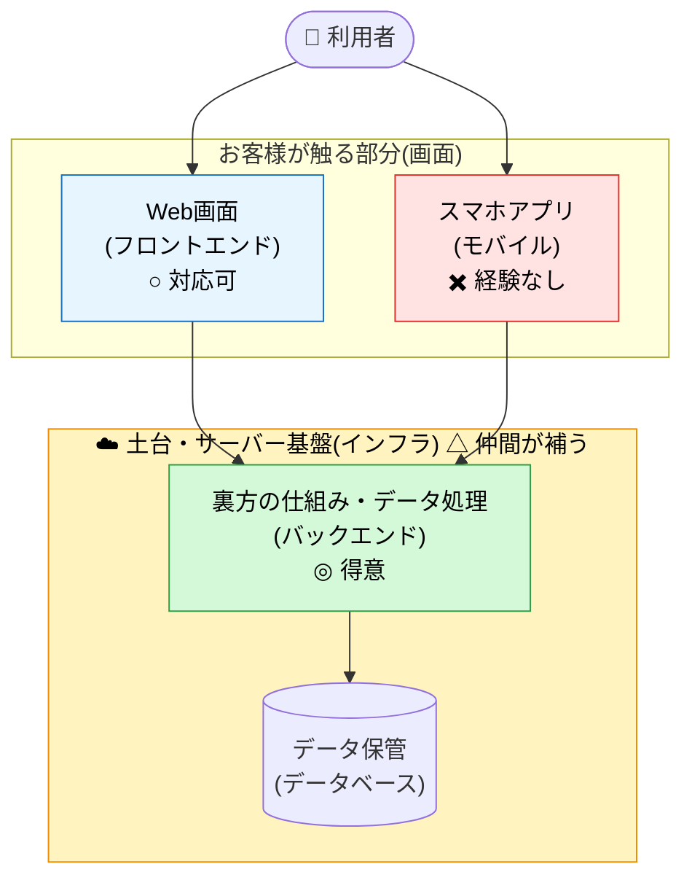

# 初回打ち合わせで伝えること

ヒアリングに入る前に、自分の状況と条件を率直に共有する。
後から「思っていたのと違う」を防ぐのが目的。

---

## 1. 稼働状況

- **副業**として参画。実作業は **主に休日(土日祝)** に行う
  - 稼働できるのは **週 1 日**
- そのため同じ作業ボリュームでも **暦日では通常より時間がかかる**。スケジュールはこの前提で設定する
- 納期は **こちらから実働ベースで逆算した期間を提示**する(例:「この規模なら休日稼働で◯週間を見ています」)
- 保守(納品後の運用対応)は **別契約**。休日中心・即時対応(SLA)は保証できない

### 体制とリスク

- 開発のコアは **自分1人**。そのため **自分が稼働できない期間(本業の繁忙・体調不良等)はプロジェクトが止まる**。週1稼働と並ぶ前提として理解いただきたい
  - その備えとして、設計・仕様・運用手順の **ドキュメントを整備し、他者に引き継げる状態を保つ**(属人化を避ける)
- 本業があり、就業規則上 **副業が認められている範囲** で受ける。**本業と競合する案件は受けられない**

## 2. 技術スタックと得意・不得意

### 構成図(各領域の対応可否)

| 領域 | 対応可否 | 補足 |
| --- | --- | --- |
| バックエンド | ◎(主ポジション) | 設計から実装まで一通り対応可 |
| フロントエンド（Web） | ○ | 対応可能 |
| モバイルアプリ | ✖️ | 経験がなく、ハイパフォーマンスは出せない |
| インフラ | △ | 不得手、ただし**頼れる人がいる**ので体制で補える |

- 「モバイルアプリ専業の開発者」ではない点は最初に明言する
- ネイティブのチューニングや凝った UI が中心の案件は対応不可
- バックエンド + Web 管理画面の比重が大きい案件なら強みを出せる
- **UI デザイン制作は範囲外**。デザイン案・ワイヤーフレームは先方手配を前提とする(自分は実装側)
- **ストア申請まわりの責任分界を最初に決める** — App Store / Google Play のアカウント保有・申請・審査対応を「先方側」とするか「自分側」とするか。基本は **アカウントは先方保有**、申請作業は協議とする
- **もしモバイル専業のエンジニアに当てがあるなら、まずそちらに依頼することを勧める**
  - 品質・速度・後の保守の観点で、専業の方が確実にメリットが大きい
  - 自分が受けるのは「専業に頼めない事情がある場合」のセカンドベストという位置付け
- **モバイル領域は未経験のため、キャッチアップ(学習)の時間も稼働に含めて請求する**
  - 未経験領域である分、同じ成果でも稼働時間が増える。だからこそ、専業に頼める当てがあるならそちらを勧めている(上記と連動)
- **場合によっては「バックエンドのみ」で受けることも許容する**
  - モバイル(およびフロント)を別の専業エンジニアに任せ、自分は **得意なバックエンド + データ処理に専念する** 形での参画も可能
  - この切り分けなら、未経験領域のキャッチアップ稼働が不要になり、品質・速度の面でも先方にメリットが大きい
  - 役割分担(API の仕様・責任分界・連携の進め方)を最初に明確にすることが前提

## 3. 料金の考え方

### 大前提:契約形態はフェーズで分ける

- **仕様が固まるまで(=作るものが確定するまで)は SES(準委任)** で進める
  - この段階は成果物ではなく「稼働時間」に対して支払ってもらう
  - 仕様検討・調査・試作など、変更が前提の作業はこちらで受け止めきれないため
  - 工数、納期の見積もりもこのフェーズに含める
- **作るもの(仕様)が固まってからは請負** に切り替える
  - 確定した範囲のみを成果物保証付きで受ける

### SESの見積もり方

- **SES でエンジニア 1 人 月 100 万円前後**(フルタイム=週 5 前提)
  - 自分は週 1 日稼働なので、単純按分で **月 20 万円相当** が目安
  - 時給換算すると **月 100 万 ÷ 160h ≒ 6,250 円 / 時間** が単価の起点
- 相場を知らない先方には「フルタイム 1 人なら月 100 万が一般的」と最初に共有して認識を揃える

### 請負の見積もり方

- **見積もった工数(時間)に SES の 1.5 〜 2.0 倍を掛けて算出する**
- 倍率を上乗せする理由は、請負では以下のリスクを加味されるため:
  - 仕様についての食い違い（認識のズレ・後出しの変更）
  - 納期の遅延リスク（想定しきれていなかった問題が発生したとき、遅延解消の努力が求められるため）
  - 支払いリスク
- **依頼者が小規模・個人の場合は、これらのリスクを大きく見積もり、倍率を高め(2.0 倍寄り)に取る**
- いずれの場合も、契約不適合責任の **範囲・期間・上限を契約で明示** する

### 請求の実務(インボイス)

- 現状 **適格請求書発行事業者には未登録**(免税事業者)。そのため **インボイス(適格請求書)は発行できず、先方は支払額の消費税分を仕入税額控除できない**
  - 先方が法人の場合、その分の実質負担が増える点を **見積もり提示の前に共有** しておく(後出しの値引き交渉を避けるため)
- 提示金額は **税込・税抜のどちらか** を明確にして伝える(消費税の扱いは別途相談)
- 支払いサイト・着手金の有無は契約時に詰める

### 契約まわりのその他

- **著作権・ソースコードの帰属**: 原則として **検収・支払い完了をもって先方に譲渡(または利用許諾)** する。詳細は契約で明示
- **途中で中断・撤退する場合**: SES(準委任)フェーズは **稼働した分を清算** して終了。請負フェーズは契約の解除条件に従う

## 4. スケジュール感

- 週1でしか作業できないため、小規模のアプリでもそれなりに時間がかかる。特にモバイルアプリの場合はキャッチアップから始める必要がある。
  - **リリース時期: 2027 年(来年)移行を想定していただく**

## 5. 進め方のスタンス

- 仕様が固まりきっていない段階は **SES(準委任)** を推奨
- 仕様が完全に固まった範囲のみ **請負** で受ける
- ドキュメント・議事録ベースの非同期コミュニケーションを優先
- やりとりは **Slack 等の非同期コミュニケーションツール** で行う(平日日中の即時対応・リアルタイム会議は前提にしない)
  - 返信の目安は **本業のある平日は遅れがち、まとまった対応は休日** になる。緊急の即応は約束できない
- コード管理は **GitHub** で行う
- **ドキュメントを整備・管理し、他者に引き継げる状態を保つ**(設計・仕様・運用手順を残し、属人化を避ける)

## 6. 開発手法について(LLM 活用の方針)

- 開発には **LLM(Claude Code 等の AI コーディング支援)を活用する**
  - 限られた稼働時間で生産性を最大化するため
- ただし **生成コードをそのまま納品することはしない**
  - 自分の目で **レビューし、必要に応じて手で修正・リファクタリング**
  - 設計判断・セキュリティ・パフォーマンスは人間側で責任を持つ
  - テストを書き、動作確認をした上で納品

### 守秘・セキュリティの扱い(LLM 利用にあたって)

- **機密情報・個人情報・顧客データそのものを LLM に投入することはしない**
  - 投入するのは抽象化した設計や一般的なコードに限る
- 利用する AI サービスは **入力データを学習に使わない契約形態(商用 API / 商用プラン)** で運用する
- NDA を締結する場合は、その範囲内で AI を利用することを合意事項に含める
